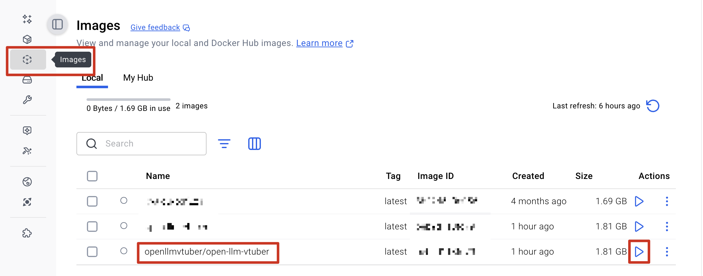
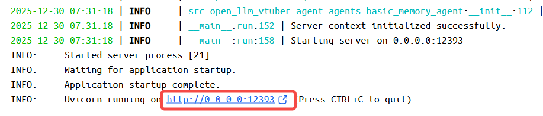
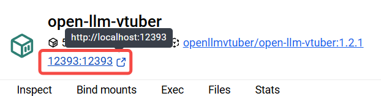

import Tabs from '@theme/Tabs';
import TabItem from '@theme/TabItem';

# Docker 部署

## 开始之前
请下载docker版用户配置文件
([点击这里前往配置文件代码仓库](https://github.com/Open-LLM-VTuber/OLV-Docker-Config))

### git下载（推荐）
先[按照Quick Start安装 git](../../quick-start.md/#安装-git)

然后
```bash
# 进入项目目录
cd D:\

# 克隆仓库
git clone https://github.com/Open-LLM-VTuber/OLV-Docker-Config
```

### zip下载（适合萌新）
:::warning 这样下载的话没法更新，但是当下是可以用的。
:::
在网页右上角，点击 `Code` -> `Download ZIP` 下载 docker 用户配置, 如下图。


## 修改配置
如果自己有想修改的配置，就修改`conf.yaml`。

:::info 默认的 `conf.yaml` 是英文的，如果想替换成中文，请去 `config_templates` 文件夹下复制 [`conf.ZH.default.yaml`](https://github.com/Open-LLM-VTuber/OLV-Docker-Config/blob/main/config_templates/conf.ZH.default.yaml), 然后回到上一级, 替换掉原来的 `conf.yaml`
:::

如果你是小白，建议直接用默认的配置文件，可以一键启动。

如果你想改一些配置，比如人设、模型、asr、tts等，可以参考[Quick Start里的修改配置部分](../../quick-start.md/#修改配置文件)。

## 安装Docker

:::tip 关于安装方式
目前支持两种方式。
- 如果您是小白，推荐您[使用Docker DeskTop](#使用-docker-desktop)。
- 如果您对Docker比较熟悉，也可以[使用终端命令](#使用终端命令)。
:::

:::caution 关于GPU支持
目前**仅支持CPU和Nvidia GPU**, 且GPU需要配置好Nvidia驱动, 如果还没配置好, 请[**点击这里查看配置攻略**](../../quick-start.md#nvidia-gpu-支持)。

如果您不打算使用GPU，而是**调用api**（这也是**绝大多数用户体验最好的方式**），或者使用CPU，可以忽略此步。
:::

:::note 关于我们`Docker`团队
我们在 docker hub 成立了[openllmvtuber团队](https://hub.docker.com/orgs/openllmvtuber/members)，目前Docker镜像由[@Harry_Y](https://github.com/Harry-Yu-Shuhang)维护。
:::

## 使用 Docker Desktop

:::warning 由于 `Docker Desktop` 退出重启经常卡死，建议尽量避免重启，如果重启很久以后没有反应，可以在任务管理器 (`Windows`) 或者 活动监视器 (`macOS`) 里杀掉 `Docker Desktop` 的后台进程，然后再次启动。
:::

### 下载 Docker Desktop

访问 [Docker Desktop 下载页面](https://www.docker.com/products/docker-desktop)。

点击 "Download Docker Desktop"


根据电脑类型选择对应版本

:::tip 如何选择适用于自己电脑的版本
- **Mac Apple Silicon** → 新款 Mac (M1/M2/M3 芯片)  
- **Mac Intel Chip** → 老款 Mac (Intel 处理器)  
- **Windows AMD64** → 大部分 Windows 电脑 (Intel/AMD 64 位)  
- **Windows ARM64** → 少见，仅 ARM 架构 Windows (如 Surface Pro X)  
:::

如果您还不确定，可以按如下方法查看系统设置：

<Tabs groupId="operating-systems">
  <TabItem value="windows" label="Windows">

1. 右键 **此电脑 → 属性**
2. 在 **系统类型** 一栏查看：  
   - “基于 x64 的处理器” → 选择 **Windows AMD64**  
   - “基于 ARM 的处理器” → 选择 **Windows ARM64**

  </TabItem>
  <TabItem value="macos" label="macOS">

1. 点击屏幕左上角苹果图标 → **关于本机**  
2. 在“芯片”一栏查看：  
   - 显示 **Apple M1/M2/M3** → 选择 **Mac Apple Silicon**  
   - 显示 **Intel** → 选择 **Mac Intel Chip**

  </TabItem>
</Tabs>

### 启动 Docker Desktop

双击下载好的安装包，按照提示完成安装。

安装完成后，点击 Docker Desktop 图标启动 Docker。

首次启动时，Docker Desktop 会要求您登录 Docker Hub 账号。如果您没有账号，需要先注册一个。

### 获取 Docker 镜像

点击顶部菜单的 **Search** 图标（或使用快捷键 `Ctrl + K`(Windows)或者`Cmd + K`(MacOS)）。


在搜索框中输入以下内容，搜索到以后点击右侧的**Pull**按钮。

```
openllmvtuber/open-llm-vtuber:latest
```


### 运行 Docker 镜像

点击**Images**, 找到**openllmvtuber/open-llm-vtuber**, 点击右侧的运行按钮。


### 运行 Docker 容器

点开"Optional settings", 按照下图配置，


等待,第一次拉取会比较慢。

### 在浏览器打开web界面
等到出现这几行字，如下图，就说明启动成功了。


点击左上角的 `12393:12393`，如下图，或者在浏览器输入 `http://localhost:12393`


**恭喜你，成功了**，和你的虚拟伴侣对话吧！

## 更新
### 更新 Docker 镜像


## 使用终端命令