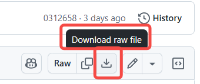
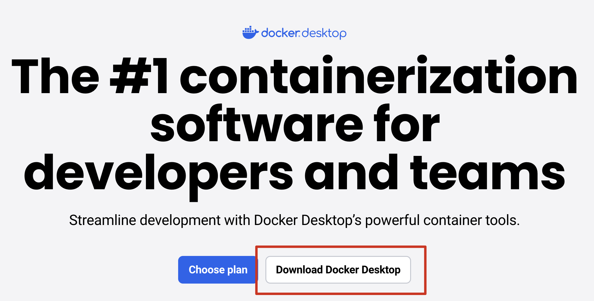
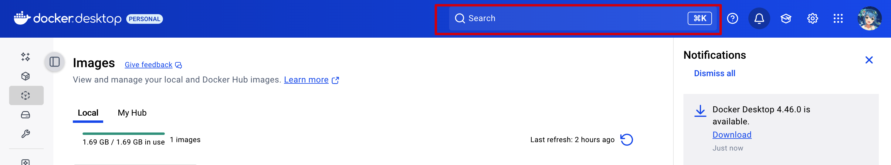
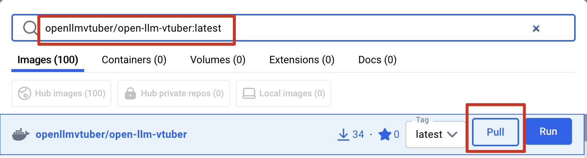
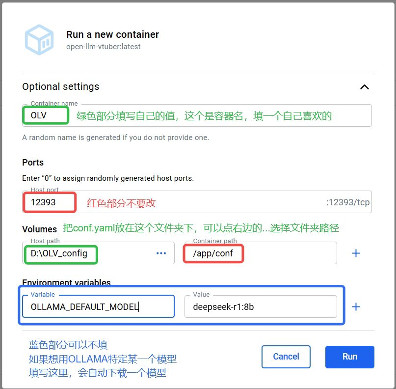

import Tabs from '@theme/Tabs';
import TabItem from '@theme/TabItem';

# Docker 部署

:::info 开始之前
请复制一份配置文件模板

[点击这里前往中文配置文件网页](https://github.com/Open-LLM-VTuber/Open-LLM-VTuber/blob/main/config_templates/conf.ZH.default.yaml)

在网页右上角，有一个"Download raw file"按钮，如下图，点击进行下载



下载完成后，将您的配置文件改名为conf.yaml,并将以下部分

```yaml
'system_config':
  'host': '127.0.0.1'
```

的**host改为0.0.0.0**
```yaml
'system_config':
  'host': '0.0.0.0'
```

然后，如果自己有想修改的配置，就修改conf.yaml,更换asr，llm，tts等。将改好的conf.yaml放到一个特定的路径，后面运行 Docker 容器这一步的Volumes需要填写conf.yaml所在的文件夹。

:::
:::tip 关于安装方式
目前支持两种方式。
- 如果您是小白，推荐您[使用Docker DeskTop](#使用docker-desktop)。
- 如果您对Docker比较熟悉，也可以[使用终端命令](#使用终端命令)。
:::

:::caution 关于GPU支持
目前**仅支持CPU和Nvidia GPU**, 且GPU需要配置好Nvidia驱动, 如果还没配置好, 请[**点击这里查看配置攻略**](../../quick-start.md#nvidia-gpu-支持)。

如果您不打算使用GPU，而是**调用api**（这也是**绝大多数用户体验最好的方式**），或者使用CPU，可以忽略此步。
:::

:::note 关于我们的docker团队
我们在 docker hub 成立了[openllmvtuber团队](https://hub.docker.com/orgs/openllmvtuber/members)，目前docker镜像由[@Harry_Y](https://github.com/Harry-Yu-Shuhang)维护。
:::

## 使用 Docker Desktop 安装

### 下载 Docker Desktop

访问 [Docker Desktop 下载页面](https://www.docker.com/products/docker-desktop)。

点击 "Download Docker Desktop"



根据电脑类型选择对应版本

:::tip 如何选择适用于自己电脑的版本
- **Mac Apple Silicon** → 新款 Mac (M1/M2/M3 芯片)  
- **Mac Intel Chip** → 老款 Mac (Intel 处理器)  
- **Windows AMD64** → 大部分 Windows 电脑 (Intel/AMD 64 位)  
- **Windows ARM64** → 少见，仅 ARM 架构 Windows (如 Surface Pro X)  
:::

如果您还不确定，可以按如下方法查看系统设置：

<Tabs groupId="operating-systems">
  <TabItem value="windows" label="Windows">

1. 右键 **此电脑 → 属性**
2. 在 **系统类型** 一栏查看：  
   - “基于 x64 的处理器” → 选择 **Windows AMD64**  
   - “基于 ARM 的处理器” → 选择 **Windows ARM64**

  </TabItem>
  <TabItem value="macos" label="macOS">

1. 点击屏幕左上角苹果图标 → **关于本机**  
2. 在“芯片”一栏查看：  
   - 显示 **Apple M1/M2/M3** → 选择 **Mac Apple Silicon**  
   - 显示 **Intel** → 选择 **Mac Intel Chip**

  </TabItem>
</Tabs>

### 启动 Docker Desktop

双击下载好的安装包，按照提示完成安装。

安装完成后，点击 Docker Desktop 图标启动 Docker。

首次启动时，Docker Desktop 会要求您登录 Docker Hub 账号。如果您没有账号，需要先注册一个。

### 获取 Docker 镜像

点击顶部菜单的 **Search** 图标（或使用快捷键 `Ctrl + K`(Windows)或者`Cmd + K`(MacOS)）。



在搜索框中输入以下内容，搜索到以后点击右侧的**Pull**按钮。

```
openllmvtuber/open-llm-vtuber:latest
```



### 运行 Docker 镜像

点击**Images**, 找到**openllmvtuber/open-llm-vtuber**, 点击右侧的运行按钮。


### 运行 Docker 容器

点开"Optional settings", 按照下图配置，


然后等待,第一次拉取会比较慢。


## 使用终端命令安装