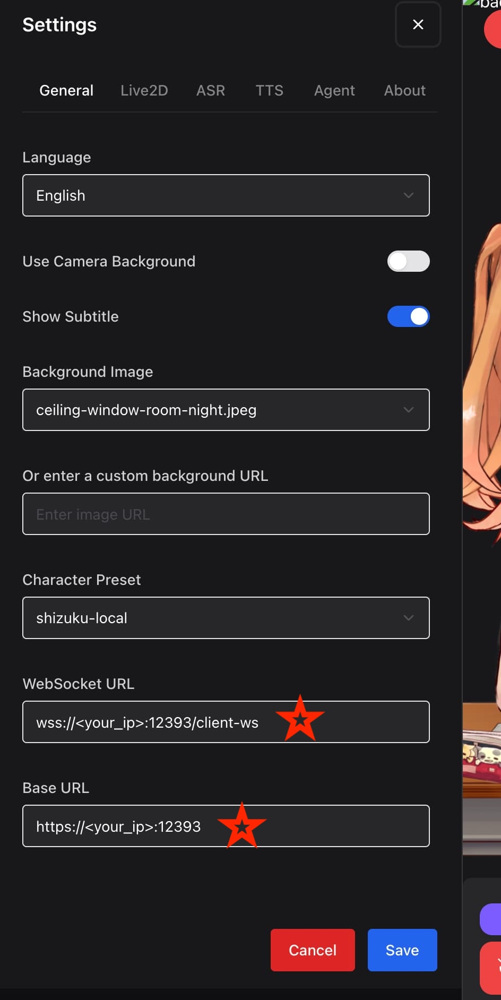

# 远程部署，非本地部署，手机


如果你
- 尝试在远程服务器上运行 Open-LLM-VTuber，在本地访问
- 尝试在局域网内运行 Open-LLM-VTuber，让其他设备访问 (比如手机)
- 尝试把你的 Open-LLM-VTuber 公开给全世界使用

这里有一些注意事项:


### 请把后端设置中的 `host` 改成 `0.0.0.0`
预设绑定的 `localhost` 会让你的 Open-LLM-VTuber 只能被本机访问。想要其他设备访问，就得改成 `0.0.0.0`，这样其他设备才能用你这台机器的 ip 地址访问。


### 请使用 https 和 wss

Open-LLM-VTuber 的前端是网页应用，由于[浏览器的安全限制](https://developer.mozilla.org/en-US/docs/Web/API/MediaDevices/getUserMedia)，麦克风会打不开，前端会因此显示 vad error。


### 访问前端时，请在前端设置正确的 `WebSocket URL` 和 `Base URL`
前端页面打开后左上角有个设置按钮，请正确设置 `WebSocket URL` 和 `Base URL` 的参数，把协议 (就是开头的东西) 改成 https 和 wss，接着把 ip 改成后端的 ip，接着你应该就能看到背景被正确加载，且页面上的连接状态变成了绿色。




### 手机访问?
移动端，推荐使用 [Open-LLM-VTuber-Unity](https://github.com/Open-LLM-VTuber/Open-LLM-VTuber-Unity) 项目，是专门设计给手机使用的，可以看看。
- 目前不支持 iOS，因为我们没有苹果开发者账号，没办法给应用签名。

为什么不推荐用手机浏览器直接访问呢？
- 由于 iOS 系统限制，每次 AI 说话的时候都必须要用明确的用户交互，所以 AI 每说一句话，你就得点一次屏幕，否则它说不出来。
- 安卓浏览器由于浏览器内核繁多，可能有些浏览器会出现兼容性问题，推荐使用 Google Chrome 手机版访问。


### 请不要公开你的 Open-LLM-VTuber 页面
我们项目并不是为了公开部署设计的，有相当多的安全漏洞，请不要公开到公网。

如果可以的话，请不要开放端口，别忘了公开 Ollama 端口的教训。如果你不知道的话，有不少网站会扫描所有开放着 Ollama 端口的服务器，给你一个列表，让你白嫖 ollama 的服务，甚至可以选地区。你也不希望出现在拿个列表上吧？

我们项目的开发资源远不如 Ollama，在安全方面约等于没有。请不要公开你的 Open-LLM-VTuber 端口。有很多工具能在不公开服务给全世界的状况下愉快访问服务器，比如 Cloudflare tunnel，tailscale 之类的。

如果你完全不懂网络，看到上面那串字觉得很慌，你没必要慌，这只针对哪些玩 NAS，自部署，服务器的人。你在自己电脑上跑运行在 `localhost` 上的 Open-LLM-VTuber 没人打的了你。


## 所以局域网运行也需要证书？不公开的局域网可以有证书？
有两种方式，可能有更多方式，但我不熟悉
1. 自签名证书
2. 如果你有域名的话，申请证书可以使用 DNS-01 Challenge，可以不用有公网地址，也不用开放端口。

这两种方法都比较复杂，这里不赘述。


## 一些绕开 https 的方法 (未经测试):

### SSH 本地端口转发
如果你能 ssh 到部署 Open-LLM-VTuber 的设备上，可以使用 ssh 本地端口转发，将服务器上的端口映射到本地端口上，使浏览器以为 Open-LLM-VTuber 运行在本地，并放行。

```sh
ssh -L 12393:localhost:12393 用户名@远程服务器地址
```

这个命令的意思是将远程服务器的 12393 端口 (Open-LLM-VTuber 的预设端口) 映射到本地的 12393 端口。

映射之后，就可以直接用 `http://localhost:12393` 访问 Open-LLM-VTuber 服务了，不再需要 https 了。


### 将服务器 ip 地址添加到浏览器的白名单 (待补充)
我听说有人可以把 ip 地址和端口添加到浏览器白名单，让浏览器针对 Open-LLM-VTuber 服务放宽不安全环境无法打开麦克风的限制，但我不知道细节，欢迎补充文档。
