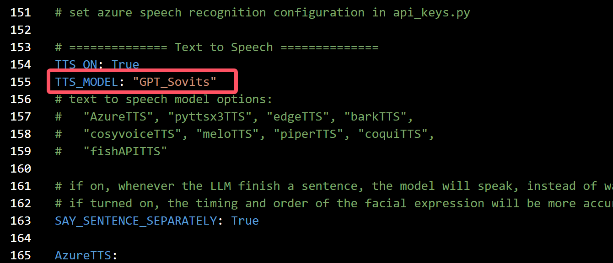
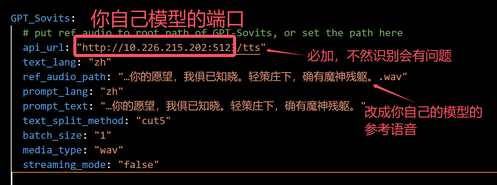
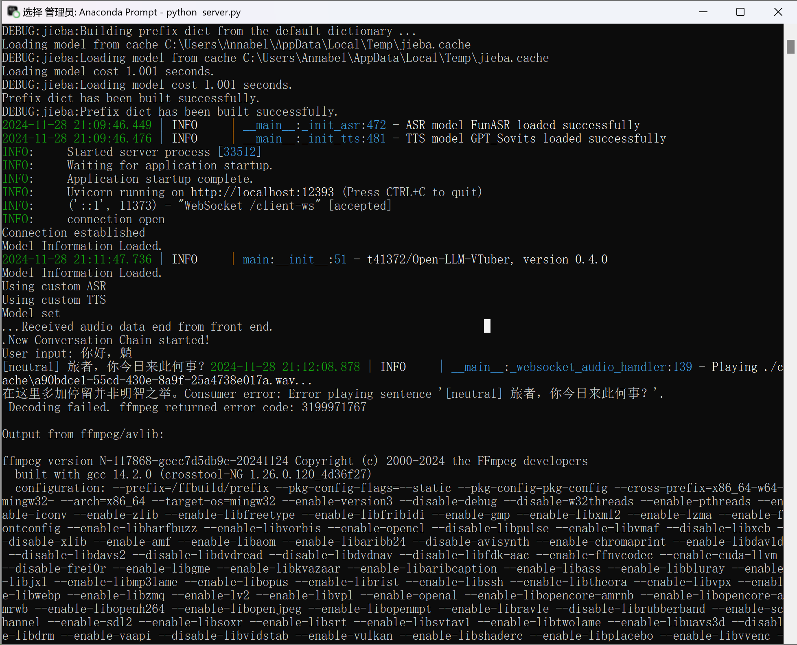
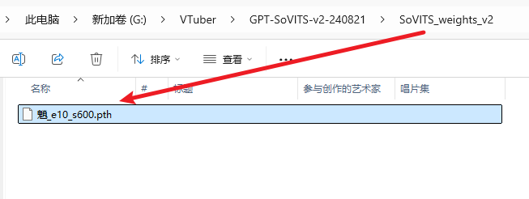
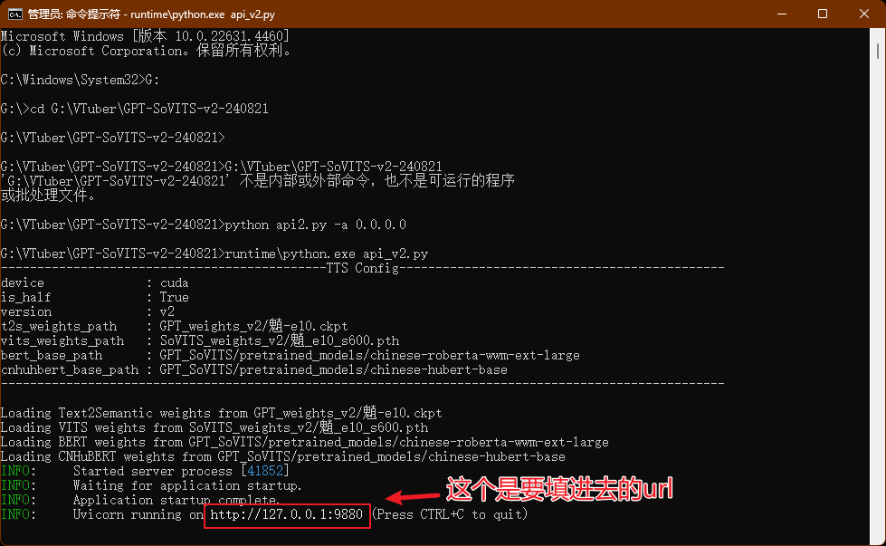

# Speech Synthesis (TTS)

After installing the required dependencies and configuring `conf.yaml`, enable the corresponding speech synthesis engine by modifying the `TTS_MODEL` option in `conf.yaml`.

## sherpa-onnx (Local & Recommended)
> Available since version `v0.5.0-alpha.1` ([PR#50](https://github.com/t41372/Open-LLM-VTuber/pull/50))

sherpa-onnx is a powerful inference engine that supports multiple TTS models (including MeloTTS). It is built-in supported and uses CPU inference by default.

**Configuration Steps:**
1. Download the required model from [sherpa-onnx TTS models](https://github.com/k2-fsa/sherpa-onnx/releases/tag/tts-models)
2. Modify `conf.yaml` referring to the configuration examples in `config_alts`

:::tip
For GPU inference (CUDA only), please refer to [CUDA Inference](/docs/user-guide/backend/asr#cuda-inference).
:::

## pyttsx3 (Lightweight and Fast)
A simple and easy-to-use local TTS engine that uses the system's default speech synthesizer. We use `py3-tts` instead of the more famous `pyttsx3` because `pyttsx3` seems unmaintained and failed to run on the test computer.

**Configuration Steps:**
1. Install by running `uv pip install py3-tts`
2. Set `tts_model: pyttsx3_tts` in `conf.yaml`

- 1. Install using the command `uv pip install py3-tts`.
- 2. This TTS engine has no configuration options, simply set `tts_model: pyttsx3_tts` in `conf.yaml`.

:::info
This package will use the default TTS engine on your system:
- Windows uses the sapi5 engine
- macOS uses the nsss engine
- Other platforms use the espeak engine
:::

## MeloTTS (Local Deployment)
:::warning Important Note
- It is strongly recommended to use MeloTTS through sherpa-onnx, rather than installing the more complex official version
- MeloTTS has dependency conflicts with Coqui-TTS. Please do not install them simultaneously
- The official version of MeloTTS may encounter mps-related errors on macOS (solutions are welcome)
:::

### Installation Steps
> Starting from project version `v1.0.0`, we use `uv` to manage dependencies, which greatly simplifies the installation process of MeloTTS.

1. Install MeloTTS and necessary components:
```sh
# Install MeloTTS
uv add git+https://github.com/myshell-ai/MeloTTS.git

# Download unidic
python -m unidic download
```

2. Download additional dependencies:
```sh
# Enter Python interpreter
python

# Download necessary NLTK data
>>> import nltk
>>> nltk.download('averaged_perceptron_tagger_eng')
# Press Ctrl+D to exit the interpreter when finished
```

3. Configure and enable:
- Edit the project's `conf.yaml` file
- Set `tts_model` to `melo_tts`

### Additional Notes
- Official documentation: [MeloTTS Installation Guide](https://github.com/myshell-ai/MeloTTS/blob/main/docs/install.md)
- If encountering `mecab-python` related issues, try using this [branch](https://github.com/polm/MeloTTS) (Note: As of 2024/7/16, it has not been merged into the main branch)

## Coqui-TTS (Local Deployment)
:::warning Important Note
- Coqui-TTS has dependency conflicts with MeloTTS. Please do not install them simultaneously
:::

Coqui-TTS is an open-source speech synthesis toolkit that supports multiple models and languages. The inference speed depends on the size and complexity of the chosen model.

### Installation Steps
```sh
# Install Coqui-TTS and its language support
uv add transformers "coqui-tts[languages]"
```

### Model Configuration
1. View available models:
```sh
uv run tts --list_models
```

2. Configure in `conf.yaml`:
```yaml
 coqui_tts:
      # Name of the TTS model to use. If empty, the default model will be used
      # Run "tts --list_models" to list models supported by coqui-tts
      # Some examples:
      # - "tts_models/en/ljspeech/tacotron2-DDC" (single speaker)
      # - "tts_models/zh-CN/baker/tacotron2-DDC-GST" (Chinese single speaker)
      # - "tts_models/multilingual/multi-dataset/your_tts" (multi-speaker)
      # - "tts_models/multilingual/multi-dataset/xtts_v2" (multi-speaker)
      model_name: "tts_models/en/ljspeech/tacotron2-DDC" # Model name
      speaker_wav: "" # Path to reference audio file
      language: "en" # Language
      device: "" # Device
```

- **Single Language Models**:
   - Default configuration is for English single language model
   - For Chinese support, please change to a Chinese model (e.g., `tts_models/zh-CN/baker/tacotron2-DDC-GST`)

- **Multilingual Models**:
   - `speaker_wav`: Path to reference audio file
     - Supports relative paths (e.g., `./voices/reference.wav`)
     - For Windows, when using absolute paths, change `\` to `\\`
     - Ensure the reference audio file exists at the specified location
   
   - `language`: Set the preferred language
     - Set to `"zh"` for Chinese
     - Set to `"en"` for English
     - This parameter corresponds to `speaker_wav`

## GPTSoVITS (Local Deployment, Moderate Performance)
> Introduced in [PR #40](https://github.com/t41372/Open-LLM-VTuber/pull/40), officially released in version v0.4.0

GPT-SoVITS is a powerful speech synthesis engine capable of high-quality voice cloning.

:::note
Note: The official tutorial for GPTSoVITS is currently not comprehensive.
Some of the following content has been compiled from the [Tencent Document](https://docs.qq.com/doc/DTHR6WkZ3aU9JcXpy), which was created by the users from the qq group before the release of `v1.0.0` (the doc was blocked by tencent for some reason so it is no longer maintained). 

If you encountered any problems or would like to improve the documentation, please use the edit button at the end of this page or just contact me.
:::

### [GPTSoVITS-V2 Integration Package](https://www.yuque.com/baicaigongchang1145haoyuangong/ib3g1e/dkxgpiy9zb96hob4#KTvnO)

### [miHoYo One-Click Package](https://www.bilibili.com/video/BV1D7421R7Rn)

#### If you are using the miHoYo one-click package:
First launch GPT SoVITS, then launch this project (`uv run run_server.py`).

You need to modify the following settings:

1: Change the tts option in conf.yaml to gpt_sovits (surely no one would overlook this step)

- This screenshot was taken before the release of `v1.0.0`. Please enter `gpt_sovits` instead of `GPT_Sovits`.

2: Modify the corresponding configuration parameters in gpt_sovits below:

from top to bottom, the red text in the image says:
- The url of the GPT sovits server endpoint
- please have the `/tts` at the end of the url
- change the `ref_audio_path` to the path of the reference audio of the model you use.

If it prompts that GPT-Sovits loaded successfully but ffmpeg reports a decoding failure, it's because you didn't add /tts:


#### If you are using the GPT-SovitsV2 integrated package:
1: The modifications in conf.yaml are the same as the previous step, but place the corresponding models in the appropriate locations. Put the GPT model (with .ckpt extension) in the GPT_weights_v2 folder, the SoVITS model (with .pth extension) in the SoVITS_weights_v2 folder. If you don't change the location of the reference audio, it should be placed in the GPT-Sovits root directory, alongside api_v2.py;




2: Run GPT-SovitsV2, navigate to the GPT-Sovits root directory, and in the prompt run `python api_v2.py -a 0.0.0.0`. 

If there's no response, use the Python that comes with the integrated package, and in the prompt run `runtime\python.exe api_v2.py`. When it prompts "TTS config", it indicates that it has loaded successfully. You can then leave it running in the background.


- the red text says: this is the url you need to put into conf.yaml

## Bark (Local Deployment, Relatively Slow)
1. Install dependencies:
    ```sh
    uv pip install git+https://github.com/suno-ai/bark.git
    ```
2. Set `tts_model: bark_tts` in `conf.yaml`
3. Required models will be automatically downloaded on first launch

## CosyVoice TTS (Local Deployment, Slower)
1. Configure and start WebUI according to [CosyVoice Official Documentation](https://github.com/FunAudioLLM/CosyVoice)
2. Refer to the API documentation in WebUI to configure the `cosyvoice_tts` section in `conf.yaml`

#### CosyVoice2 TTS (Local Deployment)

1. Set up the environment according to [CosyVoice Official Documentation](https://github.com/FunAudioLLM/CosyVoice)
2. Download CosyVoice2 model `CosyVoice2-0.5B`
3. Modify CosyVoice's `webui.py` file
   - ```
     audio_output = gr.Audio(label="Synthesized Audio", autoplay=True, streaming=True) 
     change to ->
     audio_output = gr.Audio(label="Synthesized Audio", autoplay=True, streaming=False)
     ```
    - ```
         logging.info('get instruct inference request')
         set_all_random_seed(seed)
         for i in cosyvoice.inference_instruct(tts_text, sft_dropdown, instruct_text, stream=stream, speed=speed):
             yield (cosyvoice.sample_rate, i['tts_speech'].numpy().flatten())
      change to ->
              logging.info('get instruct inference request')
              prompt_speech_16k = postprocess(load_wav(prompt_wav, prompt_sr))
              set_all_random_seed(seed)
              for i in cosyvoice.inference_instruct2(tts_text, instruct_text, prompt_speech_16k, stream=stream, speed=speed):
                  yield (cosyvoice.sample_rate, i['tts_speech'].numpy().flatten())
      ```
4. Start CosyVoice WebUI
5. Install gradio_client in this project using the command `uv add gradio_client`
6. Configure the `cosyvoice2_tts` section in `conf.yaml`

Currently, only the base model of CosyVoice2 - `CosyVoice2-0.5B` has been released, which only supports "3s Quick Voice Cloning", "Cross-lingual Voice Cloning", and "Natural Language Control"
- In "3s Quick Voice Cloning" mode, you need to fill in prompt_wav_upload_url and prompt_wav_record_url as reference audio, and prompt_text as the corresponding text for the reference audio
- In "Cross-lingual Voice Cloning" mode, you need to fill in prompt_wav_upload_url and prompt_wav_record_url as reference audio. Best results are achieved when the generated audio language differs from the reference audio language
- In "Natural Language Control" mode, you need to fill in prompt_wav_upload_url and prompt_wav_record_url as reference audio, and instruct_text as the control instruction, such as "speak Cantonese", "use an enthusiastic tone"

:::warning 
Please fill in prompt_wav_upload_url and prompt_wav_record_url with the same path
It's recommended to set stream (streaming generation) to False, as this project already includes voice segment synthesis (definitely not because setting it to True causes bugs)
:::

#### X-TTS (Local Deployment, Relatively Slow)
> Available since version `v0.2.4` ([PR#23](https://github.com/t41372/Open-LLM-VTuber/pull/23))

It is recommended to use xtts-api-server, which provides clear API documentation and is relatively easy to deploy.

## Edge TTS (Online, No API Key Required)
- Features:
  - Fast response speed
  - Requires maintaining network connection
- Configuration: Set `tts_model: edge_tts` in `conf.yaml`

#### Fish Audio TTS (Online, API Key Required)
> Available since version `v0.3.0-beta`

1. Install dependencies:
```sh
uv pip install fish-audio-sdk
```
2. Configuration steps:
   - Register an account on [Fish Audio](https://fish.audio/) and obtain an API key
   - Select the desired voice and copy its Reference ID
   - In `conf.yaml`, set:
     - `tts_model: fish_api_tts`
     - Fill in `api_key` and `reference_id` in the `fish_api_tts` section

### Azure TTS (Online, API Key Required)
> The same TTS service as neuro-sama

1. Obtain an API key for the text-to-speech service from Azure
2. Fill in the relevant configuration in the `azure_tts` section of `conf.yaml`
:::warning
Since version `v0.2.5`, `api_key.py` has been deprecated. Please make sure to set the API key in `conf.yaml`
:::
:::tip
The default voice used in `conf.yaml` is the same as neuro-sama
:::