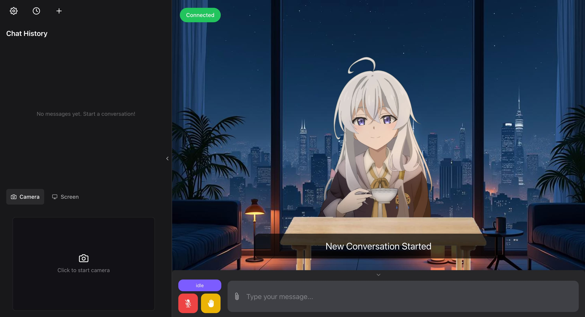
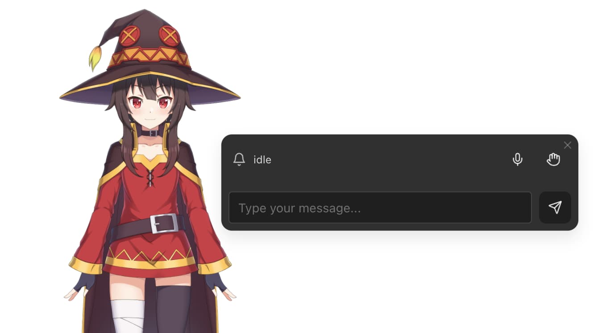

# Mode Introduction

Open LLM VTuber offers three modes of use to meet the needs of different users: [Web Mode](web), [Window Mode](web), and [Desktop Pet Mode](pet).

All three modes use localStorage to store user personalization settings.

Web Mode requires deployment or accessing a publicly hosted web link to use.

Window Mode and Desktop Pet Mode are two modes based on the Electron application, supporting Windows and Mac systems, but not mobile devices currently. You can download the installer package for your platform directly from the [Download Page](/docs/download) (recommended), or download the source code for testing or packaging.

Window Mode and Pet Mode share context, meaning you can switch between the two modes freely while maintaining your current settings, state, and connection.

:::warning About Security Warnings
Since our desktop application has not been code-signed, you may encounter the following security warnings:

- **Windows**: When running, you may see a "Windows protected your PC" warning. Simply click "More info" and then select "Run anyway" to proceed.
- **macOS**: When first opening, you may see a warning that the app "is damaged and can't be opened. You should move it to the Trash". To resolve this:
  1. Run the command `sudo spctl --master-disable` in terminal
  2. Open System Settings - Security & Privacy, select "Allow apps downloaded from: Anywhere"
  3. Run the command `xattr -d com.apple.quarantine "/Applications/open-llm-vtuber-electron.app"` in terminal
  4. Try opening the app again

You can search for these errors to learn more about them and their solutions.

These warnings occur because the application has not been certified by the operating system and will not affect the normal use of the application. In the future, we may consider resolving this issue completely through code signing.
:::

:::info About Updates
Currently, the application does not support automatic update checking. To get the latest version, you can follow the version release information on the Github Release page, or try using the latest unstable branch (not recommended except for developers).
:::

:::note Detailed Instructions

For specific usage methods and features of each mode, please refer to
- [Web Mode User Guide](./web.md)
- [Window & Desktop Pet Mode User Guide](./electron.md)
:::

## Web Mode

Web Mode is a standalone web version that can be used online in any modern browser on any platform after deployment, without the need for installation.

:::tip Browser Choice
For the best experience, it is recommended to use Google Chrome browser for access
:::

:::warning About iOS
iOS prohibits browsers from playing audio, requiring constant clicking for the speaking function to work normally.
:::

:::warning Remote Access Considerations
When you remotely access the deployed Web application (i.e., the deployment server and the access device are not on the same machine, even if they are on the same local network, it is considered remote access), please note that microphone and camera can only be used in a secure context (HTTPS or localhost). For detailed explanation, please refer to [MDN Web Docs](https://developer.mozilla.org/en-US/docs/Web/Security/Secure_Contexts). Therefore, to use these features normally on a remote device, you must configure HTTPS protocol for the Web server.
:::

## Window Mode

Window Mode is the default display mode for the desktop client, with an interface and functionality essentially consistent with Web Mode.

## Desktop Pet Mode

Desktop Pet Mode transforms the character into a desktop companion with a transparent background, global top-most display, and free dragging, providing a more immersive experience.

